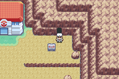
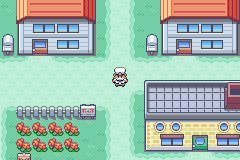
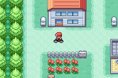
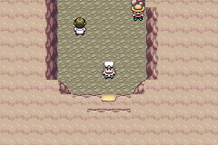
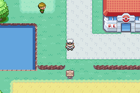
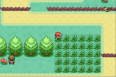
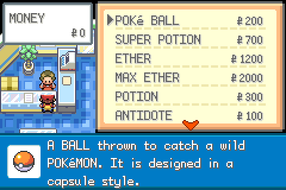

# Pokémon FireRed and LeafGreen

This is a fork of the PRET project with custom features. Development is AI-assisted (Claude Code) with human review and direction.

## Added Features

- **Real-Time 4-Player Multiplayer** — Multi-player position sync via GBA Serial I/O, with remote player sprites on shared maps.

- **Procedurally Generated Mt. Moon** — Cellular automata cave generation with guaranteed walkable paths.

  

- **Quick Select Menu** — Press SELECT in the overworld to use HMs directly and access registered items from a single menu.

  

- **Character Select** — Choose your player character at the start of the game.

  

- **Cycle Anywhere** — Use the bicycle anywhere without restrictions.

  

- **Type Effectiveness Colors in Battle** — Move text in the FIGHT menu is colored by effectiveness: green for super effective, yellow for not very effective, red for no effect.

  

- **Walk With Pokemon** — Your pokemon follows you around in the overworld.

  

- **Shiny Chaining (Gen 4 PokéRadar)** — Granted at game start. Use in tall grass to spawn shaking patches; defeating or catching the same species from patches builds a chain, boosting shiny odds up to ~1/200 at chain 40.

  

- **PP Items in Marts** — Ether, Max Ether, Elixir, and Max Elixir are now sold in Pokémon Marts, tiered to match the HP restorers already available: Ether/Max Ether alongside Super Potions, Elixir alongside Hyper Potions, Max Elixir alongside Max Potions.

  

This is a decompilation of English Pokémon FireRed and LeafGreen.

It builds the following ROM images:

* [**pokefirered.gba**](https://datomatic.no-intro.org/?page=show_record&s=23&n=1616) `sha1: 41cb23d8dccc8ebd7c649cd8fbb58eeace6e2fdc`
* [**pokeleafgreen.gba**](https://datomatic.no-intro.org/?page=show_record&s=23&n=1617) `sha1: 574fa542ffebb14be69902d1d36f1ec0a4afd71e`
* [**pokefirered_rev1.gba**](https://datomatic.no-intro.org/?page=show_record&s=23&n=1672) `sha1: dd5945db9b930750cb39d00c84da8571feebf417`
* [**pokeleafgreen_rev1.gba**](https://datomatic.no-intro.org/index.php?page=show_record&s=23&n=1668) `sha1: 7862c67bdecbe21d1d69ce082ce34327e1c6ed5e`

To set up the repository, see [INSTALL.md](INSTALL.md).

For contacts and other pret projects, see [pret.github.io](https://pret.github.io/).
